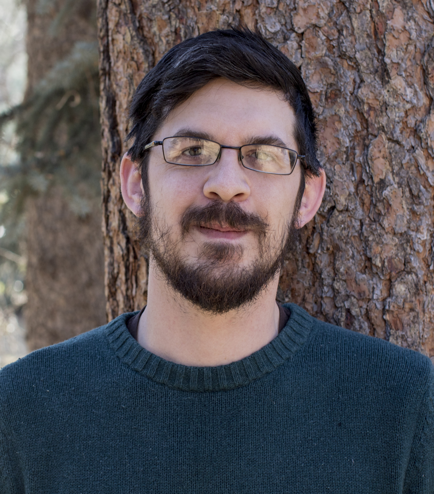

 

 
I'm a doctoral student and research associate at Colorado State University. I'm also the site maintainer. I have over a decade of professional experience in natural resources, performing tasks such as crusing forests, digging fireline, or writing silvicultural prescriptions. I current do forestry consulting for public and private landowners, and am a NRCS Technical Service Provider. During the majority of my working hours,, I study fire behavior, fire effects, and forest ecology through a spatial lens. My research bridges field ecology, taking me into the woods to measure trees, and numerical experimentation, where I write code and sometimes get flustered with fire simulations when I mess up parameterization.  

<a href="mailto:Justin.Zieger@Colostate.edu">
<i class="fa fa-send fa-lg"></i> Connect with me</a>
 
<a href="https://github.com/EcoFire">
<i class="fa fa-github fa-lg"></i> EcoFire GitHub</a>
 
<a href="https://www.linkedin.com/in/justin-p-ziegler-b5230466/">
<i class="fa fa-linkedin fa-lg"></i> My LinkedIn</a>
 
<a href="https://github.com/EcoFire">
<i class="fas fa-graduation-cap"></i> My Google Scholar</a>
         
        

         

<h1>My research</h1>

> Forests are inherently complex ecosystems. If you were to look at a map of trees, understory plants, and the underlying topography, you couldn't help but identify spatial patterns and start to think there must be some reason why you see that pattern and not some other pattern. 

>I study dry forests in the Western US. It is increasingly recognized that trees are not randomly spaced in a forest. In fact, trees tend to display characteristic non-random patterns. This might have a big impact on forest dynamics, in other words how the forest will look in the future. And
Big trees that are closer to each other might compete more intensely, or they might make a more tight knit canopy, shading and protecting the next generation. In addition, in these forests, it is clear that wildfires historically played a substantial role in shaping and maintaining forest structure. So for me, that begs many questions like: how does grouping alter fire behavior should a wildfire occur?; Should forest managers space out trees to reduce the risk of mortality for individual trees?; Or should managers look to the groupy and non-random historical forests in recognition that historic forests endured frequent fires over centuries?  

>These questions have led me to develop a suite of research questions that investigate spatial patterns in vegetation which arise from anthropogenic or natural processes. Specifically, my doctoral work asks what role wildfire plays in shaping these patterns and how managers can manipulate patterns to modify fire behavior. To answer these questions, I use a variety of tools such as spatial statistics, computational fluid dynamics fire behavior models, and scientific computing software. EcoFire is my platform to discuss the ideas in my research and the computational nitty-gritty with the public and to connect with fellow researchers.

Some publications I've been involved with.
<iframe onload="resizeIframe(this)" src="https://ecofire.shinyapps.io/shinyresearch/" style="border: none; width: 900px; height: 1000px; display:block;"></iframe>

 

 