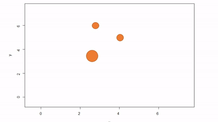

<br>

>I'm currently working on an  package that compiles existing stem-maps from prior studies. I want to encourage other researchers to collaborate and share their datasets. Of course, the best way to ask for stem-maps is to first provide a way for researchers to construct stem-maps. This blog post describes how to derive a set of (X,Y) coordinates in Cartesian space using azimuth-distance obsevations.

###A brief explanation of stem-mapping
While reduced technology continues to advance and GIS skills are now commonplace in any research group, sometimes the cost and complexity of dealing with high-precision GPS units (plus any time spent processing raw geospatial data) is overkill. Often, researchers just want to know how far every observation (trees in this example) is from every other observation (note: a map of spatial positions of trees is called a stem-map). Now there are many ways of accomplishing this task. The simplest is to call some point in space the origin (by convention it is the southwestern most point in your plot) and assume that the plot can be described in terms of Cartesian space (Cartesian coordinates are generally of two or three dimensions and dimensions share the same unit distance).

There are three common methods for stem-mapping in the field:  

1. Direct stem-mapping  
In the first, a bounding box is installed to delimit an plot; that is, the corners of the plot are identified To map trees within the plot, two measures are taken: the X coordinate and the Y coordinate. The picture below illustrates. First, the azimuth from Point A to Point B, along the X axis, is used as a baseline. Then the observer moves along the X axis, measuring the azimuth from the the observer's location (1) until the observer finds the distance along the X axis where the azimuth to the tree is perpindicular to the baseline (2). That distance along the X axis is recorded as the tree's X coordinate. The observer can either measure the distance from the X axis to the tree to estmate Y or the observed can repeat the same process along the Y axis to find the Y coordinate of the tree. The advantage of this method is that no further transformation of observations is needed; the (X,Y) of the tree is known. The disadvantages are that it can be tediously slow, as it also requires that the plot edges must be marked with measuring tape, and there is a potential for obstructed views. If views are obstructed, the observer can move to another boundary. Another disadvantage is that the lengths along axes must be corrected for slope in order to reveal horizontal distance. This isn't problematic for sloped planes, but real-world topography is undulating. In general I would not recommend this method because of slope and time issues. Because this method yields (X,Y) coordinations, I won't show examples in R.   


<br>
2. Fixed-reference stem-mapping   
In this method, a reference point is chosen within the plot. By convention it is the southwest, often the lower left corner. Here the X-axis can also be the baseline. The azimuth from the reference point to the tree and distance from the reference point to the tree is measured. The figure below describes the process. Note that the azimuth *from* a source to the target *to* be mapped is called the foresight line. By convention, I use foresight line azimuths but it's worth noting that some people measure backsight and some measure both (one can average the foresight angle and 360 minus the foresight angle to reduce measurement error).     

<br>
Using fixed-reference stem-mapping in this manner also requires identifying corners of a plot but no measuring tapes need to be laid out. Another disadvantage is that, because one measures angle from the same fixed point, if there are nearby obstructions, almost every tree is going to be obstructed. There is another approach that can speed-up the process of establishing a plot while reducing the likelihood of obstructions: the reference point can be placed in the middle of the plot. And, if the reference point's coordinates are known with respect to an origin, an additional offset can be applied after tree coordinates are calculated (I will demonstrate this later). There are additional advantages to using a central reference point: corners of the plot do not need to be identified; therefore, the plot can take on any shape (or have no clear delineation at all).  
<br>
3. Sequential-reference stem-mapping  
The last method starts with a reference point, measures the azimuth and distance to a target tree. The reference point often is a tree. In this example, we'll call the original reference tree A and the first target tree B. So the original azimuth-distance observation describes A->B. Then, the azimuth and distance to the next tree, C, is measured from B. Then, from C to D, the azimuth and distance is measured, and so on. This method is great because there is very little chance of obstruction between nearby trees as the distances will be small. In addition, there is no need to establish plot corners unless desired and the plot can take on whatever shape desired, if it has any shape at all. This method can also be made to fit within a delineated plot. After converting azimuth and distance observations to (X,Y) coordinates, one could offset all coordinates by the (X,Y) of the initial reference tree.  


### Fixed-reference stem-mapping  
#### From a corner  
I'll demonstrate the methods and the calculations to convert azimuth-distance observations to (X,Y) coordinates starting with fixed-reference stem-mapping. Here `obs` includes the identity of trees, `treeNum`, `HD` is the horizontal distance from the reference point, and `AZ` is the azimuth from the reference point. The scenario here is that we are standing at (0,0), the plot is 70 m X 70 m, and we are measuring distance and azimuth from the origin to each tree. We will write a function to get our (X,Y) coordinates. Don't dwell on the geometry but *it is important to recognize* that the specific equations we use depend whether the tree is in a northeast, southeast, southwest, or northwest quadrant from where we stand. Another thing to remember is that these trigonometric operators expect azimuth in radians whereas we almost always are measuring in degrees. So, if you see odd constants, they reference $angle*\pi/180 = radians$.

```{r}
obs = data.frame(
treeNum = c(1:15),
HD = c(70.1, 61.9, 55.9, 54.0, 48.0, 46.4, 43.2, 43.0, 56.2, 49.2, 52.2, 42.2, 42.6, 36.8, 36.9), 
AZ = c(349.7, 352.1, 346.3, 344.4, 355.9, 339.1, 331.3, 330.7, 327.8, 304.0, 301.1, 307.0, 308.8, 322.5, 325.2))

map.fixedRef = function(HD, AZ, refX = 0, refY = 0) {
    theta = (360 - AZ)
    thetarad = theta * pi/180
    x = ifelse(theta > 270, HD * cos(6.283185 - thetarad),
        ifelse(theta > 180, -HD *cos(thetarad - 3.141593),
        ifelse(theta > 90, -HD * cos(3.141593 - thetarad),
        HD * cos(thetarad))))
    y = ifelse(theta > 270, -HD * sin(6.283185 - thetarad),
        ifelse(theta > 180, -HD * sin(thetarad - 3.141593),
        ifelse(theta > 90, HD * sin(3.141593 - thetarad),
        HD * sin(thetarad))))
    x = x + refX
    y = y + refY
    return(data.frame(x = x, y = y))
}
XY = map.fixedRef(obs$HD,obs$AZ)
plot(XY,pch=19,xlim=c(-5,75),ylim=c(-5,75))
rect(0,0,70,70, lwd=2)
```
<br>

#### From the center    
Had our reference point been in the center of the plot we would have observed different horizontal distances and azimuthes. Let's change those and then re-calculate (X,Y).

##### Azimuth and distance from and to any arbitrary locations  
We need to take a quick detour because I don't have the data for you. Before we can move on, I need to figure out what the horizontal distances and azimuths are from the center. We need two pieces of information: the geographic center, which is the mean of the minima and maxima X and Y; and the difference in coordinate space between trees and the center. Again, there is some trig here that I won't dive into.  

```{r}
centerX = (min(XY$x) + max(XY$x))/2
centerY = (min(XY$y) + max(XY$y))/2
xdiff = centerX-XY$x  
ydiff = centerY-XY$y

obs$HDcenter = sqrt((XY$x-centerX)^2+(XY$y-centerY)^2)
obs$AZcenter = -180+(ifelse(xdiff>0 & ydiff<0, abs(atan(ydiff/xdiff)), 
     ifelse(xdiff<0 & ydiff<0, pi-abs(atan(ydiff/xdiff)), 
     ifelse(xdiff<0 & ydiff>=0, pi+abs(atan(ydiff/xdiff)), 
     ifelse(xdiff>0 & ydiff>=0, 2*pi-abs(atan(ydiff/xdiff)), 
     ifelse(xdiff==0 & ydiff>0, 1.5*pi, 
     ifelse(xdiff==0 & ydiff<0, .5*pi, 0 )))))))*180/pi
```

##### Back to your regularly scheduled programming  
Now we can take the vectors of horizontal distance-azimuth relative to the center and plug them into our function.  
```{r}
plot(map.fixedRef(obs$HDcenter,obs$AZcenter),pch=19)
```

Perfect. It is entirely acceptable to have a (0,0) centered stem-map. Though if you recall, it may be that one knows the center's coordinates in relation to a plot corner. In our case, that is `r paste("(",round(centerX,2),",", round(centerY,2),")")`. So we can shift all the points back in line to our plot corner. If we did our job this plot should match the first one.

```{r}
plot(map.fixedRef(obs$HDcenter,obs$AZcenter, centerX,centerY),pch=19,xlim=c(-5,75),ylim=c(-5,75))
rect(0,0,70,70, lwd=2)
```

#### Going further  
Some stem-maps are huge. For example, I was able to help out with mapping the >17 ha [Pike Forest Dynamics Plot](https://sites.warnercnr.colostate.edu/pfdp/). In this case, the plot had to be subdivided into a grid of subplots. For each subplot, a corner can become the reference point for subsets of trees. I'll explain... Let's say we have a 210 m x 70 m plot that is divided into three subplots of equal area; that's 3x the size of the imaginary plot with have been working with. For this example, we will pretend we are in the middle subplot, thus our reference point is (70,0). 

```{r}
subplot = map.fixedRef(obs$HD,obs$AZ, refX=70,refY=0)

plot(subplot,pch=19,xlim=c(-5,215),ylim=c(-5,75))
rect(0,0,70,70,lwd=2)
rect(0,0,140,70,lwd=2)
rect(0,0,210,70,lwd=2)
```

### Sequential-reference stem-mapping  
I have no real-world experience with sequential stem-mapping but it looks much easier to do in the field. It's best to imagine a chain of linked trees where we hop from one to the next during our measurements. `treeorigintarget` describes the pair of reference and target tree identities, `HD` is the horizontal distance between the trees, and `AZ` is azimuth from the reference tree to the target tree.
```{r}
obs = data.frame(
  treeorigintarget = c("(1-2)", "(2-3)", "(3-4)", "(4-5)", "(5-6)", "(6-7)", "(7-8)", "(8-9)", "(9-10)", "(10-11)", "(11-12)", "(12-13)", "(13-14)", "(14-15)"),
  HD = c(8.6, 8.5, 2.6, 11.9, 13.8, 6.9, 0.4, 13.4, 22.8, 3.9, 11.1, 1.4, 11.1, 1.8),
  AZ = c(152.1, 213.1, 210.8, 110.5, 251.1, 217.4, 228.1, 318.2, 208.7, 261.8, 97.8, 22.7, 77.5, 49.3)
)
```

The function here will do the hard work. It is similar to our prior function except there is an intermediate step. First we calculate the (X,Y) of the target tree in relation to the reference tree. Once we do that, we assume the initial reference tree is the origin and then sequentially sum up the relative (X,Y)'s to determine an absolute (X,Y) of all trees in relation to the initial reference tree.
```{r}
map.sequenceRef = function(HD, AZ, iniX = 0, iniY = 0) {
    theta = 360 - AZ
    thetarad = theta * pi/180
    relative.x = ifelse(theta > 270, HD * cos(6.283185 - thetarad),
                 ifelse(theta > 180, -HD * cos(thetarad - 3.141593),
                 ifelse(theta > 90, -HD * cos(3.141593 - thetarad),
                 HD * cos(thetarad))))
    relative.y = ifelse(theta > 270, -HD * sin(6.283185 - thetarad),
                 ifelse(theta >180, -HD * sin(thetarad - 3.141593),
                 ifelse(theta > 90, HD * sin(3.141593 - thetarad),
                 HD * sin(thetarad))))
    x = rep(iniX, length(relative.x) + 1)
    y = rep(iniY, length(relative.y) + 1)

    for (i in 2:(length(x))) {
        x[i] = x[i - 1] + relative.x[i - 1]
        y[i] = y[i - 1] + relative.y[i - 1]
    }
    return(data.frame(x = x, y = y))
}

XY = map.sequenceRef(obs$HD,obs$AZ)
plot(XY,pch=19)

```

Again, it is possible to shift (X,Y) coordinates if we are trying to tie coordinates into a plot. We can do this if we know the (X,Y) of our initial reference tree.

```{r}
XY = map.sequenceRef(obs$HD, obs$AZ, iniX = 68.97, iniY = 12.53)
plot(XY,pch=19,xlim=c(-5,75),ylim=c(-5,75))
rect(0,0,70,70, lwd=2)

```

### Conclusion  
So there you have it. Now that you have walked through these steps you should be able to go out into the field and use your trusty compass and a laser rangefinder to grab distances and azimuths from any reference point trusting that you can convert these to (X,Y) coordinates. 
<br>

[^1]: **Ziegler, J.P.**, Hoffman, C., Battaglia, M. and Mell, W., 2017. Spatially explicit measurements of forest structure and fire behavior following restoration treatments in dry forests. Forest Ecology and Management, 386, pp.1-12. 
[^2]: Here, creation of spatstat will warn you that many points have duplicate locations. That's okay for this analysis. 
[^3]: In general, smoothing alone is best left for when maps of points don't display strong gradience over the study area 
