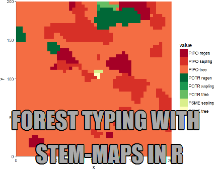

<!---
entries will follow this format:
<article>
<h3></h3>

<i class="fa fa-calendar"></i> _date_

 ...

<a class="btn btn-outline-primary btn-sm" href="">Full Post</a>

</article>
--->

 

<article>
<h3><a href="blog-forest-typing-with-stem-maps.html">Forest Typing with Stem-maps in R</a></h3>

<i class="fa fa-calendar"></i> _2016-09-01_

...what if the ecological relationship of interest occurs at a much finer resolution and one would like to relate within-plot variability of some measure to an overstory-based typology. This post dives into using Spatstat to transform point-based observations to two-dimensional surfaces with categorical values...

</article>

