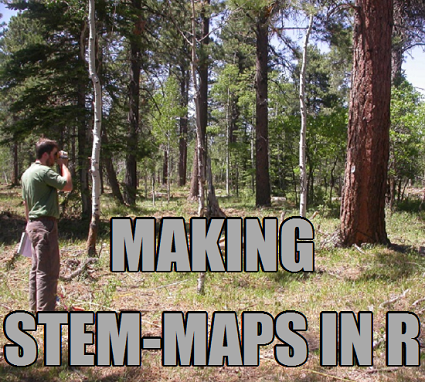
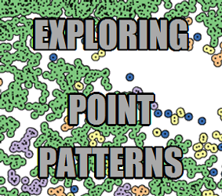

<h1>BLOG</h1>

<!-- <a class="btn btn-outline-secondary btn-lg" href="blog.html" role="button">More Posts</a> --> 

 

 

<h1>ABOUT</h1>

 

>`as.numeric(ecology)` was developed to allow graduate-level and early career ecologists and natural resource scientists a place to discuss and share *how* their work is accomplished. This is needed given the increased reliance on software coding, complex statistical analyses, and large datasets. This website serves as a place to share and discuss methods which are written in an explicitly reproducible manner.

>Why the need? Reproducibility is a major tenet of the scientific process. However, methods, which are key for reproducing research, are often underdescribed and given short shrift in research. Due in part to this, some fields in science are undergoing what is being described as a reproducilibilty crisis. To combat this, researchers are actively working with many journals and other platforms to build new ways to develop and detail their methods in full.

Would you like to contribute? We are looking for graduate students and early career scientists in ecological fields that want to share their work. Topics can be brief or extended so long as they sufficiently detail a field, lab, or code based method. If you're interested, go ahead and [connect with us](mailto:Justin.Zieger@Colostate.edu). 

<h2>Our authors</h2>
 
[**Justin Ziegler**](author-ziegler.html)
 
>>> I am the maintainer of `as.numeric(ecology)`. I study fire behavior and fire ecology using spatial statistical methods and computational fluid dynamics modelling. I am also a doctoral student and research associate at Colorado State University. See more about [my research here](author-ziegler.html).
 

 

 
